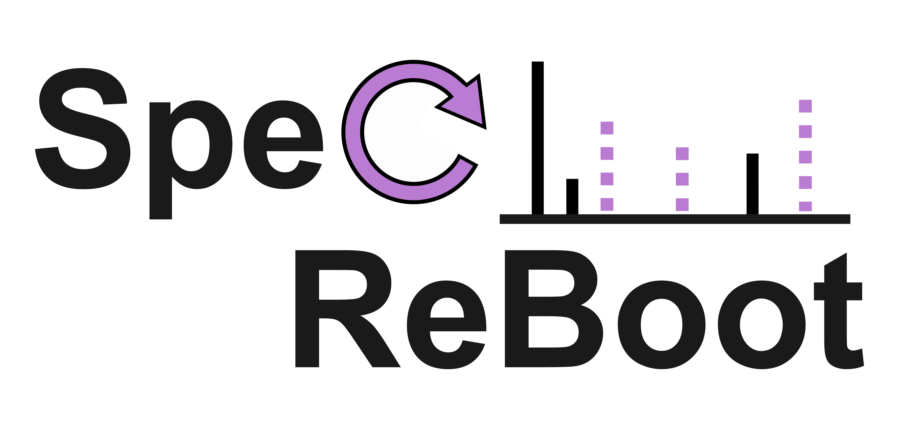

[](https://doi.org/10.5281/zenodo.18466798)
[](https://doi.org/10.5281/zenodo.18466976)

*Statistical bootstrapping for spectral similarity and molecular networking*

> **Status:** in active development 🚧  
> Feedback, ideas, issues, and PRs are very welcome!

---

## What is SpecReBoot?

**SpecReBoot** brings the spirit of **phylogenetic bootstrapping** to **MS/MS molecular networking**.

In phylogenetics, bootstrapping asks: *“If I slightly perturb my data, do I recover the same relationships?”*  
SpecReBoot asks the same question for MS/MS spectra:

**“If I resample spectral features, do I recover the same edges in the network?”**

SpecReBoot generates pseudo-replicate spectra (via feature resampling), recomputes similarities across replicates, and reports **edge support** as a robustness measure for spectral relationships.

---

## What do you get?

For a dataset + similarity method, SpecReBoot produces:

- **Mean similarity matrix** (consensus similarity across replicates)
- **Edge support matrix** (how often an edge is recovered across replicates)
- **Networks (GraphML)**:
  - **Base network** (similarity threshold)
  - **Threshold network** (similarity + support + component-size constraints)
  - **Core–rescue network** (strict “core” edges + rescued edges)

This helps you:
- Filter unstable / fragile edges  
- Improve reproducibility across instruments and studies  
- Compare robustness across similarity methods

---

## Key ideas (in plain English)

- **Spectral features ≈ alignment positions** (but for fragments / losses / learned features)
- **Bootstrapping** = repeatedly resample features → pseudo-replicate spectra
- **Edge support** = fraction of replicates where two spectra are recovered as *mutual top-K neighbours*
- **Consensus network** = build using similarity **and** support thresholds

---

## Similarity scores supported

SpecReBoot can run multiple similarity methods so you can compare robustness across “classic” and learned scores:

- **Flash Cosine / Flash Modified Cosine**  
  Fast cosine-based scoring (fragment and hybrid matching). Great baseline and scalable.

- **Spec2Vec**  
  A machine-learning similarity that treats peaks like “words” and spectra like “documents”.  
  Uses a trained Word2Vec model to compare spectra by learned peak co-occurrence patterns.

- **MS2DeepScore (MS2DP)**  
  Deep learning embeddings for spectra. Similar spectra have nearby embeddings, allowing robust similarity even when peak overlap is imperfect.

> Note: Spec2Vec and MS2DeepScore require pre-trained models (paths passed via CLI).

---

## Installation (conda + editable install)

### 1) Install conda
If you don’t have conda yet, Miniconda is enough:  
https://docs.conda.io/projects/conda/en/latest/user-guide/install/index.html

### 2) Clone the repository
First clone our repository where you want it:

```shell
git clone https://github.com/ECharria/SpecReBoot.git   
```

### 3) Create a new, clean conda environment (recommended)
Go to the **SpecReBoot repo root**:

```bash
cd SpecReBoot
```
Now create the environment using the .yml file:
```bash
conda env create -f environment.yml
conda activate specreboot
```

### 4) Install SpecReBoot 
Then from the repo root type in the bash terminal: 

```shell
pip install -e .   
```
quick test:
```shell
specreboot --help
```

SpecReBoot is developed on Linux and macOS.

## Getting started 🚀

SpecReBoot provides a single command with two modes:
* matchms → full workflow: preprocessing → bootstrapping → network generation
* gnps → compute bootstrap + merge rescued edges into an existing GNPS GraphML network

Help is always available:

```shell
specreboot --help
specreboot matchms --help
specreboot gnps --help
```

### Mode 1 — matchms (full pipeline)
Runs:
1. preprocessing (general_cleaning)
2. binning
3. bootstrapping across multiple similarity scores
4. exports CSV + GraphML networks + runtime log

Example:
```shell
specreboot matchms \
  --mgf "/.../input_spectra.mgf" \ #to configure
  --ms2dp-model "/.../ms2deepscore_model.pt" \
  --spec2vec-model "/.../Spec2Vec.model" \
  --outdir "/.../output_matchms" \
  --prefix "Reboot" \
  --B 30 --k 5 --n-jobs 4 \
  --sim-threshold 0.7 --sim-threshold-ms2dp 0.8
```

### Mode 2 — gnps (merge rescued edges into a GNPS network)
Use this mode when you already have a GNPS network (GraphML) and want to:
1. compute bootstrap support from your spectra
2. “rescue” supported edges
3. write GNPS + rescued as a new GraphML network

Example:
```shell
specreboot gnps \
  --mgf "/.../Spectra_MN.mgf" \
  --gnps-graphml "/.../network_singletons.graphml" \
  --outdir "/.../output_gnps" \
  --prefix "Reboot" \
  --B 100 --k 5 --n-jobs 4 \
  --similarity modcos --tolerance 0.02 \
  --candidate-node-attrs "shared name" \
  --sim-core 0.7 --support-core 0.5 --sim-rescue-min 1e-5 --support-rescue 0.5
```
### Quick start — Exploring spectral connections between RiPPs (Case study from the preprint)
This repository includes a small demo MS/MS dataset of RiPPs so you can quickly test whether SpecReBoot runs correctly on your machine.

From the **repo root**, run:

```bash
specreboot matchms \
  --mgf "demo/matchms/input/Manually_collected_RiPPs_NPATLAS_GNPS.mgf" \
  --ms2dp-model "/path/to/ms2deepscore_model.pt" \
  --spec2vec-model "/path/to/spec2vec_model.model" \
  --outdir "/path/to/results_folder" \
  --prefix "RiPPs" \
  --B 30 --k 5 --n-jobs 4 \
  --sim-threshold 0.7 --sim-threshold-ms2dp 0.8
```
If the run completes successfully, results will include:
1) .csv files with mean similarity and edge support matrices
2) .pkl files storing bootstrap bin histories
3) .graphml files corresponding to the inferred molecular networks

These outputs reproduce the RiPP case study discussed in the preprint and can be used as a reference for adapting SpecReBoot to your own datasets!

## Attribution
### License

The code in this package is licensed under the MIT License.

### Citation
If you use SpecReBoot in your work, please cite:

Charria Girón, E., Torres Ortega, L. R., Mergola Greef, J., Marin Felix, Y., Caicedo Ortega, N. H., Surup, F., Medema, M. H., & van der Hooft, J. J. J. (2026). Bootstrap resampling of mass spectral pairs with SpecReBoot reveals hidden molecular relationships. *bioRxiv*. doi: [https://doi.org/10.64898/2026.02.03.703446](https://www.biorxiv.org/content/10.64898/2026.02.03.703446v1)

### Contact
Please open a GitHub Issue for bugs/feature requests.
Maintainers: Rosina Torres-Ortega (rosina.torresortea@wur.nl) and Esteban Charria-Girón (esteban.charriagiron@wur.nl)
