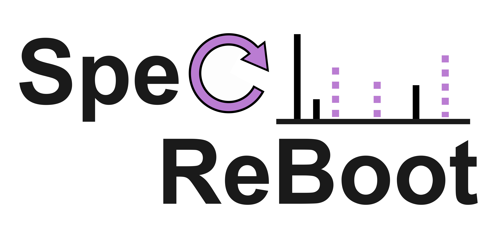

[](https://doi.org/10.5281/zenodo.18466798)
[](https://doi.org/10.5281/zenodo.18466976)

*Statistical bootstrapping for spectral similarity and molecular networking*

> **Status:** in active development 🚧  
> Feedback, ideas, issues, and PRs are very welcome!

---

## What is SpecReBoot?

**SpecReBoot** brings the spirit of **phylogenetic bootstrapping** to **MS/MS molecular networking**.

In phylogenetics, bootstrapping asks: *“If I slightly perturb my data, do I recover the same relationships?”*  
SpecReBoot asks the same question for MS/MS spectra:

**“If I resample spectral features, do I recover the same edges in the network?”**

SpecReBoot generates pseudo-replicate spectra (via feature resampling), recomputes similarities across replicates, and reports **edge support** as a confidence measure for spectral relationships.

---

## What do you get?

For a dataset + similarity method, SpecReBoot produces:

- **Mean similarity matrix** (consensus similarity across replicates)
- **Edge support matrix** (how often an edge is recovered across replicates)
- **Networks (GraphML)**:
  - **Base network** (similarity threshold) - Only when using the matchms mode
  - **Threshold network** (similarity + support + component-size constraints)
  - **Core-rescue network** (strict “core” edges + rescued edges)

This helps you:

- Filter unstable / fragile edges  
- Improve reproducibility across instruments and studies  
- Compare robustness across similarity methods

---

## Key ideas (in plain English)

- **Spectral features ≈ alignment positions** (but for fragments / losses / learned features)
- **Bootstrapping** = repeatedly resample features → pseudo-replicate spectra
- **Edge support** = fraction of replicates where two spectra are recovered as *mutual top-K neighbours*
- **Threshold network** = build using similarity **and** edge support thresholds
- **Rescued edges** = connections with high edge support but spectral similarity below threshold

---

## Similarity scores supported

SpecReBoot can run multiple similarity methods so you can compare results across “classic” and learned scores:

- **Flash Cosine / Flash Modified Cosine**  
  Fast cosine-based scoring (fragment and hybrid matching). Great baseline and scalable.

- **Spec2Vec**  
  A machine-learning similarity that treats peaks like “words” and spectra like “documents”.  
  Uses a trained Word2Vec model to compare spectra by learned peak co-occurrence patterns.

- **MS2DeepScore**  
  Deep learning embeddings for spectra. Similar spectra have nearby embeddings, allowing robust similarity even when peak overlap is imperfect.

> Note: Spec2Vec and MS2DeepScore require pre-trained models (paths passed via CLI).

---

## Parallelization strategy

Bootstrapping is a computationally expensive step, so SpecReBoot uses a **batched thread-pool** strategy via Python's `concurrent.futures.ThreadPoolExecutor`:

1. The `B` bootstrap replicates are divided into batches of size `--batch-size` (default: 10).
2. Each batch is submitted as an independent task to a pool of `--n-jobs` worker threads (default: 8).
3. Within a batch, replicates run sequentially — similarity scoring via `matchms.calculate_scores` releases the GIL, so threads provide parallelism for heavy steps.
4. In **fast mode** (default), each batch returns only aggregated pair-similarity sums and edge-support counts, minimising memory overhead during parallel execution.
5. In **history mode** (`--return-history` or `--track-bins`), each batch returns per-replicate results which are merged and sorted after all threads complete.

### Tuning performance

* **`--batch-size`**: Controls the granularity of work units sent to the thread pool. Smaller batches increase parallelism but add scheduling overhead. Larger batches reduce overhead but may leave some threads idle near the end.
* **`--n-jobs`**: Number of concurrent worker threads.

---

## Installation (conda + editable install)

### 1) Install conda

If you don’t have conda yet, Miniconda is enough:  
https://docs.conda.io/projects/conda/en/latest/user-guide/install/index.html

### 2) Clone the repository

First clone our repository where you want it:

```shell
git clone https://github.com/ECharria/SpecReBoot.git   
```

### 3) Create a new, clean conda environment (recommended)

Go to the **SpecReBoot repo root**:

```bash
cd SpecReBoot
```

Now create the environment using the .yml file:

```bash
conda env create -f environment.yml
conda activate specreboot
```

### 4) Install SpecReBoot

Then from the repo root type in the bash terminal: 

```shell
pip install -e .   
```

quick test:

```shell
specreboot --help
```

SpecReBoot is developed on Linux and macOS.

## Getting started 🚀

SpecReBoot provides a single command with two modes:
* matchms → full workflow: preprocessing → bootstrapping → network generation
* gnps → bootstrapping → network rebooting conserving GNPS metadata

Help is always available:

```shell
specreboot --help
specreboot matchms --help
specreboot gnps --help
```

### Mode 1 — matchms (full pipeline)

Runs:

1. preprocessing (general_cleaning)
2. binning
3. bootstrapping across a single or multiple similarity scores
4. exports CSV + GraphML networks

By default, cosine and modified cosine are chosen.

Example:

```shell
specreboot matchms \
  --mgf "path_to_your_expectra.mgf" \ 
  --ms2dp-model "path_to_your_ms2deepscore_model.pt" \
  --spec2vec-model "path_to_your_Spec2Vec_model.model" \
  --outdir "output_matchms" \
  --prefix "Reboot" \
  --B 30 --k 5 --n-jobs 4 --batch-size 10 \
  --sim-threshold 0.7 \
  --sim-threshold-ms2dp 0.8
```

You can restrict the run to one or more metrics using --similarities.

Example — only Modified Cosine:

```shell
specreboot matchms \
  --mgf "/.../input_spectra.mgf" \
  --similarities modcosine \
  --tolerance 0.02 \
  --outdir "/.../output_matchms" \
  --prefix "Reboot_modcos" \
  --B 30 --k 5 --n-jobs 4 --batch-size 10 \
  --sim-threshold 0.7
```

Example — multiple selected metrics:
```shell
  --similarities cosine spec2vec
```

#### Key matchms arguments

| Argument | Default | Description |
|---|---|---|
| `--mgf` | *(required)* | Input MGF file |
| `--similarities` | `cosine modcosine` | Similarity metric(s) to run (`all`, `cosine`, `modcosine`, `spec2vec`, `ms2deepscore`) |
| `--B` | `100` | Number of bootstrap replicates |
| `--k` | `5` | Top-k neighbours for mutual-kNN edge support |
| `--n-jobs` | `8` | Number of parallel worker threads |
| `--batch-size` | `10` | Replicates per thread-pool batch |
| `--sim-threshold` | `0.7` | Mean similarity threshold for cosine/modcosine/spec2vec graphs |
| `--sim-threshold-ms2dp` | `0.8` | Mean similarity threshold for MS2DeepScore graphs |
| `--support-threshold` | `0.5` | Minimum edge support for threshold graph |
| `--max-component-size` | `100` | Maximum connected-component size |
| `--tolerance` | `0.01` | Fragment m/z tolerance (Da) |
| `--decimals` | `2` | Decimal places for m/z binning |
| `--label-mode` | `feature` | Node label source: `feature`, `scan`, or `internal` |
| `--return-history` | flag | Store cumulative bootstrap history (slower, more memory) |
| `--track-bins` | flag | Store sampled/missing bins per replicate (slower) |
| `--sim-rescue-min` | `1e-5` | Minimum similarity floor for rescued edges |

---

### Mode 2 — gnps (merge rescued edges into a GNPS network)

Use this mode when you already have a GNPS2 network (GraphML) and want to:

1. compute edge support for your spectral connections
2. “rescue” supported edges with low spectral similarity
3. refine GNPS network and explore recovered connections as new GraphML networks

**Notes:** 
- only Modified Cosine allows direct comparison of the new graphs with your GNPS2 network
- bootstrap bin histories inspection is not available in this mode, use `specreboot matchms` with `--return-history` if you need cumulative bootstrap diagnostics.

Example:

```shell
specreboot gnps \
  --mgf "path_to_mgf.mgf" \
  --gnps-graphml "path_to_graphml.graphml" \
  --outdir "output_gnps" \
  --prefix "Reboot" \
  --B 100 --k 5 --n-jobs 4 --batch-size 10 \
  --similarity modcosine \
  --tolerance 0.02 \
  --candidate-node-attrs "shared name" \
  --sim-threshold 0.7 \
  --support-threshold 0.5 \
  --sim-rescue-min 1e-5 \
```

#### Key gnps arguments

| Argument | Default | Description |
|---|---|---|
| `--mgf` | *(required)* | Input MGF file |
| `--gnps-graphml` | *(required)* | Input GNPS GraphML network |
| `--similarity` | `modcosine` | Metric to use: `cosine`, `modcosine` |
| `--B` | `100` | Number of bootstrap replicates |
| `--k` | `5` | Top-k neighbours for mutual-kNN |
| `--n-jobs` | `8` | Number of parallel worker threads |
| `--batch-size` | `10` | Replicates per thread-pool batch |
| `--sim-threshold` | `0.7` | Similarity threshold for core edges and threshold graph |
| `--support-threshold` | `0.5` | Minimum edge support |
| `--sim-rescue-min` | `1e-5` | Minimum similarity floor for rescued edges |
| `--candidate-node-attrs` | `shared name` | GNPS node attribute(s) used to map bootstrap IDs to GNPS nodes |
| `--label-mode` | `feature` | Node label source: `feature`, `scan`, or `internal` |
| `--max-component-size` | `100` | Maximum connected-component size |

---

### Quick start — Exploring spectral connections between RiPPs (Case study from the preprint)

This repository includes a small demo MS/MS dataset of RiPPs so you can quickly test whether SpecReBoot runs correctly on your machine.

From the **repo root**, run:

```bash
specreboot matchms \
  --mgf "demo/matchms/input/Manually_collected_RiPPs_NPATLAS_GNPS.mgf" \
  --ms2dp-model "/path/to/ms2deepscore_model.pt" \
  --spec2vec-model "/path/to/spec2vec_model.model" \
  --outdir "/path/to/results_folder" \
  --prefix "Reboot" \
  --B 30 --k 5 --n-jobs 4 --batch-size 10 \
  --sim-threshold 0.7 --sim-threshold-ms2dp 0.8 \
  --return-history \
  --track-bins
```

If the run completes successfully, results will include:
1) .csv files with mean similarity and edge support matrices
2) .pkl files storing bootstrap bin histories
3) .graphml files corresponding to the inferred molecular networks

These outputs reproduce the RiPP case study discussed in the preprint and can be used as a reference for adapting SpecReBoot to your own datasets!

## Attribution
### License

The code in this package is licensed under the MIT License.

### Citation
If you use SpecReBoot in your work, please cite:

Charria Girón, E., Torres Ortega, L. R., Mergola Greef, J., Marin Felix, Y., Caicedo Ortega, N. H., Surup, F., Medema, M. H., & van der Hooft, J. J. J. (2026). Bootstrap resampling of mass spectral pairs with SpecReBoot reveals hidden molecular relationships. *bioRxiv*. doi: [https://doi.org/10.64898/2026.02.03.703446](https://www.biorxiv.org/content/10.64898/2026.02.03.703446v1)

### Contact
Please open a GitHub Issue for bugs/feature requests.
Maintainers: Rosina Torres-Ortega ([rosina.torresortea@wur.nl](mailto:rosina.torresortea@wur.nl)) and Esteban Charria-Girón ([esteban.charriagiron@wur.nl](mailto:esteban.charriagiron@wur.nl))
